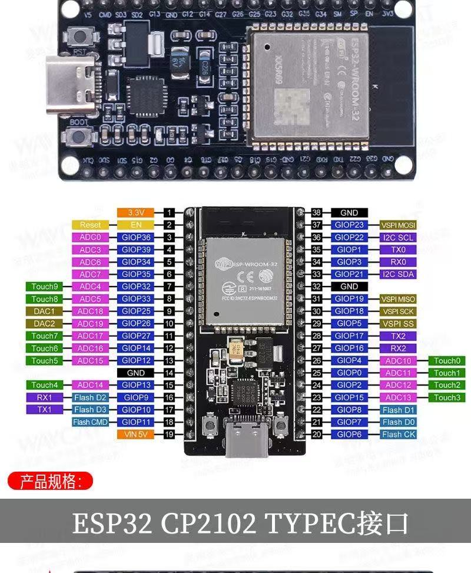

# 基本概念说明

## 1.系统架构

系统遵循所有具身智能和机器人的通用**三层架构**

- **感知层**：各类传感器。是机器人系统的**眼睛、耳朵**。通过不同的传感器，为机器人提供感知物理环境的能力。
  - 温湿度传感器
  - pm2.5传感器
  - 光敏传感器
  - 语音传感器（语音指令模块）
- **决策层**：ESP32 MCU。是机器人的**大脑**。通过获取物理世界的信息，做出决策。比如空气不好了，要通风；光线暗了要开灯。
  - MCU的意思是**主控核心**。他的作用是写入程序，并按照程序进行执行。同时他提供了很多的针脚，就是与他进行通话的**管道**，有了这些管道，传感器感知到的信息才能进入程序进行处理。
- **执行层**：机器人的**手**，也是机器人能够按照程序实现对物理世界进行干预的原因。
  - **继电器**：继电器其实就是**程序能够控制的开关**，也就是大脑的手。大脑告诉他关灯，他就直接断了灯的电。让他开风扇，他就打开风扇的电。
    - 继电器的工作原理，就是默认情况下，他的开关是关闭的，当大脑给他发信号的时候，其实就是**给他供电**，让他**用磁铁把开关吸住**，也就实现了控制器的通断。

## 2.边缘（端侧）智能

### 2.1 语音识别的原理

把一句话变成一个动作，中间是一条流水线：

- **监听** —— 麦克风一直在听，把空气的振动变成电信号。它只负责「听见」，听懂是后面的事。
- **语音识别** —— 把电信号还原成文字，回答的是「**说了什么字**」。口音、语速、背景吵不吵都需要处理掉，只为了听到“关灯“这个命令。
- **语义理解** —— 从一堆字里挑出真正的意图。说「把灯关了吧」「刚才那个关一下」，都得听明白是**关灯**。
- **输出指令** —— 把意图翻译成机器认得的暗号。本项目里就是一串 8 字节的字符，主控拿到它才知道该动哪一路继电器。
- **中文合成** —— 如果设备要回话，再把文字变回声音，大脑发给它的是一串字符，它拿到之后，发现对应的是”好的，灯已打开“，那么他需要把他合成为**小朋友的声音**，通过喇叭放出来。

## 2.2 边缘侧（端侧）

因为语音识别本身就是一个很复杂的程序过程，而大脑（MCU）本身的**聪明程度有限（运算能力有限）**，所以我们找了一个专门的MCU把与语音相关的硬件放在一起（MCU、处理代码、喇叭、麦克风），做成一个**小脑**。就形成了**主控与边缘侧的分离**。而这个接口就叫做**主从结构** —— 主控是「主」，语音模块是「从」。

这样做的目的是**专人干专事**，减少大脑的运算压力。比如国王有很多大臣，有军事大臣，财务大臣，内政大臣，分别负责自己的事情。

又比如我们的智能家居为了防止坏人，需要安装反击武器。这个武器需要看到敌人，确定敌人位置，准备武器，锁定敌人，发动攻击。等等很多事情。如果全部接到大脑上，要写很多代码，还要确保与原来的代码不打架，难度就很大。不如直接部署一个专门的反击系统。像传感器一样，接入主控，告诉主控发现敌人，已经打死就行。而有了这样的结构，我们就可以**在不增加主控压力的情况下**，部署更多的厨师系统、花园管理系统，实现**无限的能力扩展**。

## 3.协议

**协议就是设备之间交流的约定。** 就像中国人和外国人沟通，先说好都用英语，彼此才听得懂。

我们的传感器之间只有电线相连，**能传的只有电的通断** —— 有电是 1，没电是 0。
所以协议说到底，就是**约定好每一处的 1 和 0 分别代表什么意思**。

这很像**摩斯密码**：本身只有「响 / 不响」两种状态，可一旦约定下规则，就可以只通过**滴答两种声音**进行信息的传递。
短响一下是 A、两短一长是 U，就能拼出整句话。**协议也能自己约定**，
比如规定 `1111` 表示「你好」、`1100` 表示「你不好」。

约定好了，还要有人负责翻译：

- **编码** —— 把真实世界的信息变成电的信号。比如「温度 25 度」，编码后成了一串 1 和 0，才能顺着电线发出去。
- **解码** —— 主控收到这串信号，按同一份约定反着翻译回来，才读得出「25 度」。

## 4.功能说明

这个系统就是通过感知环境的温度、空气质量、光照等信息，**决定操作哪些设备**。比如天气热了，就开空调，亮度暗了就开灯。

有**三种模式**可以使用：

- **自动模式**：通过设定阈值，自动进行执行。
- **手动模式**：手动模式下，可以自己通过web页面实现对设备的控制。
- **语音控制**：一旦唤醒语音，就会实**自动切换到手动模式**，否则就会与自动模式冲突，比如自动模式觉得天暗了要开灯，但是你要睡觉了，让他关灯。包含如下的控制指令：
  - 唤醒词「**你好小丹**」—— 只负责把语音模块叫醒，不控制任何设备
  - **灯**：开灯、关灯
  - **风扇**：开风扇（也可以说「打开风扇」）、关闭风扇（也可以说「关风扇」）
  - **抽湿机**：开抽湿机、关抽湿机
  - **空调**：开空调、关空调

一个动作可以有几种说法，比如「开风扇」和「打开风扇」说的其实是同一件事，模块发出来的也是同一条指令 —— 所以不用记那么准，能说清楚就行。

## 5.接线图

接口就是大脑跟传感和继电器的通信口。

 图上黑色的是计数的。要看的是口的标号是蓝色的那一列。

### 5.1 PM2.5传感器

**工作原理：**红色的LED灯不停的闪烁，通过空气中颗粒的阴影判断空气干不干净。

| 转接板脚 | 接到        | 说明                             |
| -------- | ----------- | -------------------------------- |
| **VCC**  | **5V**      | ⚠️ 必须 5V，3.3V 不工作           |
| **GND**  | GND         |                                  |
| **AO**   | **GPIO 32** | 信号输出，输出空气干不干净的信息 |
| **ILED** | **GPIO 33** | 按照一定节奏，开关led灯。        |

### 5.2 光敏传感器

**工作原理：** 光线越强，光敏电阻的阻值越小，输出的电压就越低。主控读这个电压，就知道现在亮不亮。

| 模块脚 | 接到        | 说明                     |
| ------ | ----------- | ------------------------ |
| **VCC** | **3.3V**   | ⚠️ 别接 5V               |
| GND    | GND         |                          |
| **AO**  | **GPIO 35** | 信号输出，输出光线强弱   |
| DO     | 空着不用    | 另一路输出，本项目不用   |

### 5.3 温湿度传感器

**工作原理：** 主控和传感器共用一根数据线，一问一答地"打电报"，温度和湿度就是这样传回来的。

| 模块脚 | 接到        | 说明                   |
| ------ | ----------- | ---------------------- |
| **VCC** | **3.3V**   | ⚠️ 别接 5V             |
| **DATA** | **GPIO 13** | 数据从这条线进出       |
| GND    | GND         |                        |

### 5.4 继电器（4 路）

**工作原理：** 主控给 IN 脚一个电信号，模块内部的小磁铁就把开关吸住，接在开关另一头的设备就通电了。这样用**小电流的信号**去控制**大电流的电器**，两边电路并不直接连在一起。

| 继电器脚 | 接到        | 说明                         |
| -------- | ----------- | ---------------------------- |
| **VCC**  | **3.3V**    | 信号这一侧的供电             |
| **JD-VCC** | **5V**    | 磁铁（线圈）这一侧的供电     |
| GND      | GND         |                              |
| **IN1**  | **GPIO 25** | 风扇（进风 + 排风）          |
| **IN2**  | **GPIO 26** | 灯                           |
| **IN3**  | **GPIO 27** | 抽湿机                       |
| **IN4**  | **GPIO 14** | 空调                         |

- 被控制的电器接在继电器的**开关触点**那一侧，走的是 12V，**不能接到 ESP32 的针脚上**。
- VCC 和 JD-VCC 之间的小跳线帽**要拔掉**，不拔继电器会抖动发热。

### 5.5 语音模块

**工作原理：** 模块自己带着麦克风、喇叭和一颗小芯片，把听到的话听懂、翻译成一串暗号发给主控；主控收到后回一句"收到了"，两边才开始正常通信。这也就是第 2 节说的**主从结构**。

| 语音模块脚 | 接到        | 说明                     |
| ---------- | ----------- | ------------------------ |
| **5V**     | **5V**      | 供电                     |
| GND        | GND         |                          |
| **信号脚①** | **GPIO 16** | 模块 → 主控（收指令）    |
| **信号脚②** | **GPIO 17** | 主控 → 模块（回话）      |

> ⚠️ 这两个信号脚在板子上的印字**长得一样，光看印字分不出谁发谁收**，必须一根一根接、边接边试。
> 完整的判定步骤见 [`文档/接线与引脚.md`](接线与引脚.md) 第 2.6 节。

---

### 5.6 两条通用的规矩

1. **所有 GND 必须连成一片** —— 上面每个表格里的 GND，都要接到同一条地线上。少接一个，那个设备就完全不工作。
2. **5V 和 3.3V 别接串** —— 每个表格里标了这个脚该用哪一档，按表接就行。接反了轻则不工作，重则烧器件。

---

> 📌 **本文只写到"接哪"这一层**。至于引脚为什么这么排、哪些脚绝对不能用、供电电流够不够、怎么分步测试，
> 全部以 [`文档/接线与引脚.md`](接线与引脚.md) 为准 —— 那是接线的唯一权威文档，本文与它冲突时以它为准。